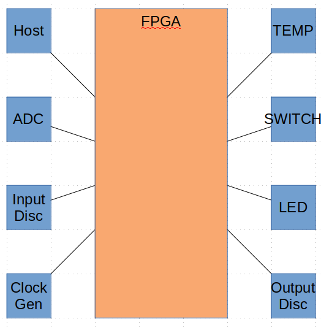

############################
Design Explorer Case Study 1
############################

**********
Objectives
**********

In this example, we will replicate the diagram below:

What we know:

  1) The system is composed of a single CCA
  2) There is an FPGA on the CCA
  3) The FPGA communicates with four devices

********
Strategy
********

#. Review Requirements
#. Identify Interfaces
#. Decompose Requirements
#. Architect FPGA

.. include::  system_level_requirements.rst

