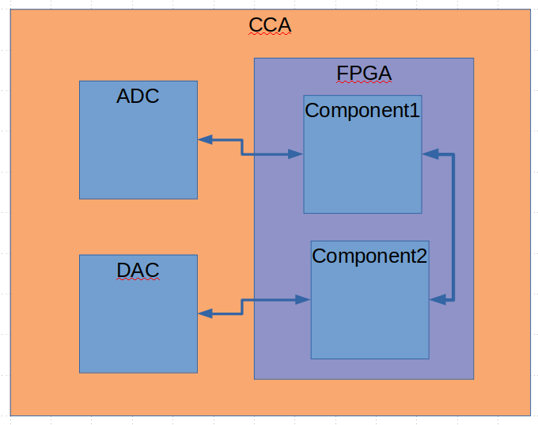

Components
==========

A component is a basic design unit.
There are many types of components:

- HW parts
- ADC
- DAC
- RAM
- FPGA
- HDL code

Only the FPGA and HDL components can hold other components.
This allows for hierarchical design.
The diagram above shows a CCA system which includes an ADC, DAC, and FPGA.
The FPGA includes an HDL component representing the top level HDL file.
The top level HDL file includes other components.
They can also contain connections, which show how those subcomponents are connected.

Each component has a set of interfaces.
Components connect to other components through these interfaces.

We can represent the high level connections in any HDL system using components and connections.

Implementation
--------------

We will implement the component as a class:

.. uml:: component_class.uml

Code Examples
-------------

Coding the diagram above would look like this:

.. code-block:: python

  oCCA = de.system.create('CCA')
  oCCA.add_component(de.hw.adc.create('ADC'))
  oCCA.add_component(de.hw.dac.create('DAC'))
  oCCA.add_component(de.hw.fpga.altera.arria10.create('FPGA'))

  oFPGA = oCCA.get_component_named('FPGA')
  oFPGA.add_component(de.hdl.entity('FPGA_TOP'))

  oTopHdl = oFpga.get_component_named('FPGA_TOP')
  oTopHdl = oFpga.add_component(de.hdl.entity('component1'))
  oTopHdl = oFpga.add_component(de.hdl.entity('component2'))

