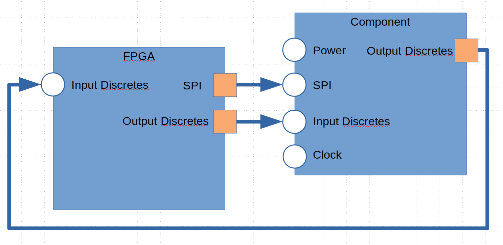

Connections
===========

Connections provide the connection between any two interfaces.

The diagram above shows three interfaces connected between the FPGA and an external component.

Connections between interfaces must align the correct ports.
This will be accomplished using a positional and named association methods.
The default will be positional.
The ports will be matched in the two interfaces starting with the first defined.

Implementation
--------------

We will implement a interface using a class.

.. uml:: connection_class.uml

Code Example
------------

.. code-block:: python

  oConnection1 = de.connection(oFpga.get_interface_named('SPI'), oComponent.get_interface_named('SPI'))
  oConnection2 = de.connection(oFpga.get_interface_named('Output Discretes'), oComponent.get_interface_named('Input Discretes'))
  oConnection3 = de.connection(oComponent.get_interface_named('Output Disretes'), oFPGA.get_interface_named('Input Discretes'))

In the above example, the default behavior is to map each port in the source port list and connect it to each port in the sink port list from index 0.
The naming of the ports do not matter, only the order. 

If the order of the ports in the two port lists do not match, then a mapping can be specified:

.. code-block:: python

  oConnection1 = de.connection(oFpga.get_interface_named('SPI'), oComponent.get_interface_named('SPI'))
  oConnection1.map('SCK', 'SCK')
  oConnection1.map('CS_N', 'CS_N')
  oConnection1.map('MOSI', 'DIN')
  oConnection1.map('DOUT', 'MISO')

Mappings are always defined from source port to sink port.

Multiple connections from and to an interface can be specified.
The output SPI data on the component is configurable and can be either the SPI data output or a status flag.

.. code-block:: python

  oConnection1 = de.connection(oComponent.get_interface_named('SPI'), oFPGA.get_interface_named('Input Discretes'))
  oConnection3 = de.connection(oComponent.get_interface_named('Output Disretes'), oFPGA.get_interface_named('Input Discretes'))

In this case, we have the Input discretes being fed by two seperate interfaces.
We will need to using mapping to ensure the correct connections are made:

.. code-block:: python

  oConnection1 = de.connection(oComponent.get_interface_named('SPI'), oFPGA.get_interface_named('Input Discretes'))
  oConnection1.map('DOUT', 'RDY_N')

  oConnection3 = de.connection(oComponent.get_interface_named('Output Disretes'), oFPGA.get_interface_named('Input Discretes'))
  oConnection3.map('ERR_N', 'ERR_N')

Any port not listed in the map will be ignored.
This allows you to select any ports on an interface and connect them to any other port on another interface.
Source ports are allowed multiple connections.
Sink ports are only allowed a single connection.
Not every source port must be connected.
Every sink port must be connected.

Sometimes not all the ports are routed where we can control them.
In this case, we just map the connections that do exist.

.. code-block:: python

  oConnection2 = de.connection(oFpga.get_interface_named('Output Discretes'), oComponent.get_interface_named('Input Discretes'))
  oConnection2.map('ADR[0]', 'ADR0')
  oConnection2.map('ADR[1]', 'ADR1')
  oConnection2.map('SYNC_N', 'SYNC_N')

The AIN1, AIN2, and AINCOM are not controlled by the FPGA, but are listed in the components interface.
By not mapping to them, a connection is not made between the FPGA and the component for those ports not listed.

The above example also shows how to map a vectored port to a non-vectore port.
You can take a single bit or a slice of bits and map them to portions of other ports.

.. code-block:: python

  oConnection.map('ADR[1:0]', 'ADDRESS[3:2]')
  oConnection.map('DATA[0]', 'STATUS[3]')

Sink ports can also be tied to power or ground:

.. code-block:: python

  oConnection.map('GND', 'WRITE_ENABLE')
  oConnection.map('VDD', 'READ_ENABLE') 

**GND** and **VDD** are keywords to the connection map method.
