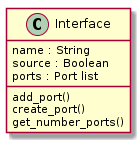

Interfaces
==========

Interfaces exist on every component and indicate communication methods between components.
A component can have multiple interfaces.
Each interface must be uniquely named on a component.
Each interface is composed of at least one port.
Each interface is a source on one component and a sink on another.

For example, the ADC `AD4110 <https://www.analog.com/media/en/technical-documentation/data-sheets/AD4110-1.pdf>`_ could be defined with the following interfaces:

================ ============
Interface        Direction
================ ============
Power            Sink
SPI              Sink
Input Discretes  Sink
Output Discretes Source
Analog Inputs    Sink
Clock            Sink
================ ============

.. image:: img/adc_interfaces.png

An FPGA which communicates with the ADC could have the following interfaces:

================ ============
Interface        Direction
================ ============
SPI              Source
Input Discretes  Sink
Output Discretes Source
================ ============

.. image:: img/fpga_interfaces.png

Naming the interfaces clarifies communication between team members.

Implementation
--------------

We will implement a interface using a class.

Code Example
------------

We can define the interfaces for the ADC and the FPGA using DE:

.. code-block:: python

   oAdc = hdl.device.create()
   oAdc.add_interface(hdl.interface('Power', False))
   oAdc.add_interface(hdl.interface('SPI', False))
   oAdc.add_interface(hdl.interface('Input Discretes', False))
   oAdc.add_interface(hdl.interface('Output Discretes', True))
   oAdc.add_interface(hdl.interface('Analog Inputs', False))
   oAdc.add_interface(hdl.interface('Clock', False))

   oFPGA = hdl.device.create()
   oFPGA.add_interface(hdl.interface('SPI', True))
   oFPGA.add_interface(hdl.interface('Input Discretes', False))
   oFPGA.add_interface(hdl.interface('Output Discretes', True))

If we wanted to grab the SPI interface on the oADC object:

.. code-block:: python

  oSpiInterface = oAdc.get_interface_named('SPI')

If we wanted to grab all the interfaces:

.. code-block:: python

  lInterfaces = oAdc.get_interfaces()

