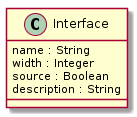

Ports
=====

Ports within an interface can be either a source or a sink.

For example, the SPI interface on the ADC is a four wire SPI interface has the following ports:

===== ====== ================
Port  Width   Direction
===== ====== ================
SCK     1     Sink
CS_N    1     Sink
DIN     1     Sink
DOUT    1     Source
===== ====== ================

The Input Discretes Interface could be defined as:

====== ====== ================
Port   Width   Direction
====== ====== ================
ADR0     1     Sink
ADR1     1     Sink
AIN1     1     Sink
AIN2     1     Sink
AINCOM   1     Sink
SYNC_N   1     Sink
====== ====== ================

The Output Discretes Interface could be defined as:

===== ====== ================
Port  Width   Direction
===== ====== ================
ERR_N   1     Source
===== ====== ================

The SPI interface on the FPGA may be named differently than the SPI ports on the ADC.

===== ====== ================
Port  Width   Direction
===== ====== ================
SCK     1     Sink
CS_N    1     Sink
MOSI    1     Sink
MISO    1     Source
===== ====== ================

This can happen if we are re-using a design or because of externally imposed naming conventions.

Implementation
--------------

We will implement a port with a class.

Code Example
------------

The SPI interface on the ADC would be coded like this:

.. code-block:: python

   # Create an interface
   oInterface = de.interface.create(name='SPI', source=False)

   # Add ports to interface
   oInterface.add_port(de.port.create('SCK',  1, False, 'SPI Clock'))
   oInterface.add_port(de.port.create('CS_N', 1, False, 'SPI Chip Select'))
   oInterface.add_port(de.port.create('DIN',  1, False, 'Data Input'))
   oInterface.add_port(de.port.create('DOUT', 1, True,  'Data Output'))

The SPI interface on the FPGA would be coded like this:

.. code-block:: python

   # Create an interface
   oInterface = de.interface.create(name='SPI', source=False)

   # Add ports to interface
   oInterface.add_port(de.port.create('SCK',  1, False, 'SPI Clock'))
   oInterface.add_port(de.port.create('CS_N', 1, False, 'SPI Chip Select'))
   oInterface.add_port(de.port.create('MOSI', 1, False, 'Data Output'))
   oInterface.add_port(de.port.create('MISO', 1, True,  'Data Input'))
   
