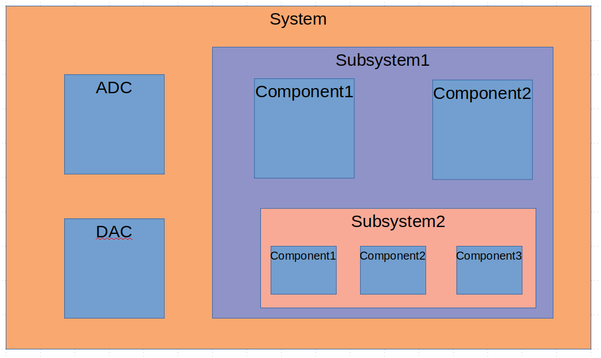

System
======

A system is a collection of components and/or other systems.

Systems can represent Circuit Card Assemblies (CCA)s, which contains a collection of Hardware components.
A system can also represent a collection of CCAs, so a complex multi-card design can be modeled.

Components represent pieces of HW: DACs, ADCs, RAMs, FPGAs, connectors, etc...
They can also represent pieces of HDL.

Implementation
--------------

We will implement a system as a class:

.. uml:: system_class.uml

A CCA will inherit from the base system class and extend the attributes and methods:

.. uml:: cca_class.uml

Additional system types can be defined.

Code Examples
-------------

If we were starting from scratch, we could create the above diagram with the following code:

.. code-block:: python

    import design-explorer as de

    oSystem = de.system.create('System')
    oSystem.add_component(de.component.create('ADC'))
    oSystem.add_component(de.component.create('DAC'))
    oSystem.add_system(de.system.create('Subsystem1'))
    
    oSubsystem1 = oSystem.get_system_named('Subsystem1')
    oSubsystem1.add_component(de.component.create('Component1'))
    oSubsystem1.add_component(de.component.create('Component2'))
    oSubsystem1.add_system(de.system.create('Subsystem2'))

    oSubsystem2 = oSubsystem.get_system_named('Subsystem2')
    oSubsystem2.add_component(de.component.create('Component1'))
    oSubsystem2.add_component(de.component.create('Component2'))
    oSubsystem2.add_component(de.component.create('Component3'))

If some of the components already existed in a library, we would just include them:

.. code-block:: python

    oSystem = de.system.create('System')
    oSystem.add_component(hw.lib.adc.analog_devices.create('ADC'))
    oSystem.add_component(hw.lib.dac.texas_instruments.create('DAC'))
    oSystem.add_system(de.system.create('Subsystem1'))
    
    oSubsystem1 = oSystem.get_system_named('Subsystem1')
    oSubsystem1.add_component(de.component.create('Component1'))
    oSubsystem1.add_component(de.component.create('Component2'))
    oSubsystem1.add_system(my_hdl_lib.systems.video_codec.create())

This allows components and systems to be re-used.
It also allows systems to be abstracted.
This will make designing large systems easier and less error prone.

